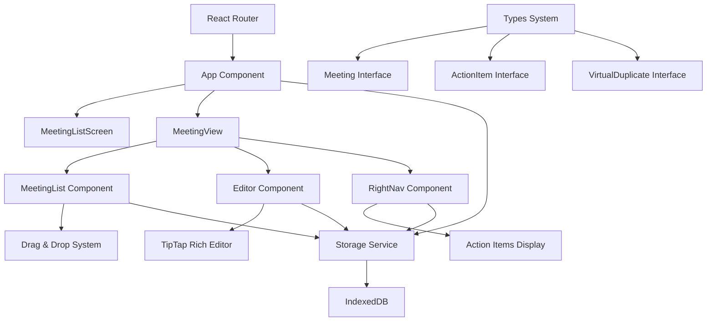

# Design Document

## Overview

The Meeting Management Application is a React-based single-page application that provides a comprehensive solution for creating, organizing, and managing meeting notes. The application follows a modern component-based architecture with TypeScript for type safety, uses IndexedDB for client-side persistence, and implements a rich text editor with advanced features like action item extraction and virtual meeting duplicates.

The application is designed as a desktop-class web application with keyboard shortcuts, drag-and-drop functionality, and a responsive three-panel layout that can be customized by the user.

## Architecture

### High-Level Architecture



### Component Hierarchy

```
App
├── Router
│   ├── MeetingListScreen (/)
│   │   ├── MeetingList
│   │   └── SearchDialog
│   └── MeetingView (/meeting/:id)
│       ├── MeetingList (Left Panel)
│       ├── Editor (Center Panel)
│       │   ├── TipTap Editor
│       │   ├── Toolbar
│       │   └── NextTimeNotes
│       └── RightNav (Right Panel)
│           ├── ActionItems
│           ├── Reminders
│           └── Export/Import Controls
└── SearchDialog (Global)
```

### Data Flow Architecture

The application follows a unidirectional data flow pattern:

1. **State Management**: Centralized in the App component using React hooks
2. **Data Persistence**: Automatic debounced saves to IndexedDB
3. **Event Propagation**: Props-based event handling with callback functions
4. **Real-time Updates**: Immediate UI updates with background persistence

## Components and Interfaces

### Core Components

#### App Component
- **Purpose**: Root component managing global state and routing
- **Responsibilities**:
  - Meeting state management (CRUD operations)
  - Action item extraction and management
  - Virtual duplicate handling
  - Auto-save with debouncing
  - Global keyboard shortcuts
  - Data import/export coordination

#### MeetingList Component
- **Purpose**: Sidebar navigation with drag-and-drop organization
- **Responsibilities**:
  - Display meetings in collapsible groups
  - Handle drag-and-drop reordering
  - Manage virtual duplicates
  - Group creation and management
  - Meeting title inline editing
  - Archive section display

#### Editor Component
- **Purpose**: Rich text editing with TipTap integration
- **Responsibilities**:
  - Rich text formatting (bold, italic, underline, etc.)
  - Task list management with indentation
  - Image handling with compression
  - Table creation and manipulation
  - Auto-save content changes
  - Keyboard shortcut handling
  - Link management

#### RightNav Component
- **Purpose**: Action items and meeting management tools
- **Responsibilities**:
  - Display extracted action items
  - Toggle action item completion
  - Export/import functionality
  - Archive meeting controls
  - Meeting metadata display

#### NextTimeNotes Component
- **Purpose**: Floating bottom panel for next meeting preparation
- **Responsibilities**:
  - Expandable/collapsible interface
  - Auto-save notes with debouncing
  - Copy notes to main meeting content
  - Visual state indicators

### Data Models

#### Meeting Interface
```typescript
interface Meeting {
  id: string;              // Unique identifier (timestamp-based)
  title: string;           // Meeting title (editable)
  date: string;            // Meeting date
  content: string;         // Rich HTML content from editor
  notes: string;           // Additional notes field
  attendees: string[];     // List of attendees
  nextTimeNotes?: string;  // Notes for next meeting
  group?: string;          // Optional group assignment
  isDivider?: boolean;     // Visual divider flag
  subDivider?: string;     // Sub-group organization
  sortOrder?: number;      // Custom sort position
  isArchived?: boolean;    // Archive status
  createdAt: number;       // Creation timestamp
  updatedAt: number;       // Last modification timestamp
}
```

#### ActionItem Interface
```typescript
interface ActionItem {
  id: string;              // Unique identifier
  text: string;            // Action item description
  completed: boolean;      // Completion status
  meetingId: string;       // Associated meeting ID
  series?: string;         // Optional series grouping
  createdAt: string;       // Creation timestamp
  completedAt?: string;    // Completion timestamp
}
```

#### VirtualDuplicate Interface
```typescript
interface VirtualDuplicate {
  id: string;              // Unique virtual ID
  originalMeetingId: string; // Reference to original meeting
  displayTitle: string;    // Custom display title
  group?: string;          // Virtual group assignment
  sortOrder: number;       // Virtual sort position
  createdAt: number;       // Creation timestamp
}
```

## Error Handling

### Storage Error Handling
- **IndexedDB Failures**: Graceful degradation with console logging
- **Import Validation**: Comprehensive JSON structure validation
- **Backup and Restore**: Automatic backup before import operations
- **Data Corruption**: Validation of required fields on load

### User Experience Error Handling
- **Network Issues**: Offline-first design with local storage
- **Performance Issues**: Debounced operations and request animation frames
- **Input Validation**: Real-time validation with user feedback
- **State Recovery**: Automatic recovery from invalid states

### Error Recovery Strategies
```typescript
// Example error handling pattern
try {
  await saveMeetings(meetings);
} catch (error) {
  console.error('Save failed:', error);
  // Attempt retry with exponential backoff
  setTimeout(() => saveMeetings(meetings), 1000);
}
```

## Testing Strategy

### Unit Testing
- **Component Testing**: React Testing Library for component behavior
- **Service Testing**: Jest for storage service functions
- **Utility Testing**: Pure function testing for data transformations
- **Type Testing**: TypeScript compilation as first-line testing

### Integration Testing
- **Data Flow Testing**: End-to-end user workflows
- **Storage Integration**: IndexedDB operations with mock data
- **Editor Integration**: TipTap editor functionality
- **Drag and Drop**: React Beautiful DnD integration testing

### Performance Testing
- **Large Dataset Testing**: Performance with 1000+ meetings
- **Memory Usage**: Monitor for memory leaks in long sessions
- **Render Performance**: Component re-render optimization
- **Storage Performance**: IndexedDB operation timing

### User Experience Testing
- **Keyboard Navigation**: All shortcuts and accessibility
- **Mobile Responsiveness**: Touch and responsive design
- **Cross-browser Compatibility**: Modern browser support
- **Offline Functionality**: Service worker and offline capabilities

## Performance Considerations

### Optimization Strategies

#### Rendering Optimization
- **React.memo**: Memoization of expensive components
- **useMemo/useCallback**: Prevent unnecessary re-computations
- **Virtual Scrolling**: For large meeting lists (future enhancement)
- **Debounced Updates**: Prevent excessive re-renders during typing

#### Storage Optimization
- **Image Compression**: Automatic compression of pasted images
- **Debounced Saves**: Batch save operations to reduce I/O
- **Incremental Updates**: Only save changed data
- **Background Processing**: Use Web Workers for heavy operations

#### Memory Management
- **Component Cleanup**: Proper cleanup of timeouts and listeners
- **Event Listener Management**: Add/remove listeners appropriately
- **Large Content Handling**: Pagination or virtualization for large content

### Performance Monitoring
```typescript
// Performance measurement example
const startTime = performance.now();
await saveMeetings(meetings);
const endTime = performance.now();
console.log(`Save completed in ${endTime - startTime}ms`);
```

## Security Considerations

### Data Security
- **Client-Side Storage**: All data stored locally in IndexedDB
- **No Server Communication**: Eliminates network security concerns
- **Data Validation**: Input sanitization and validation
- **XSS Prevention**: Proper HTML sanitization in rich text editor

### Privacy Considerations
- **Local Data Only**: No data transmission to external servers
- **User Control**: Complete user control over data export/import
- **No Tracking**: No analytics or tracking mechanisms
- **Secure Defaults**: Safe default configurations

## Accessibility Features

### Keyboard Navigation
- **Full Keyboard Support**: All functionality accessible via keyboard
- **Focus Management**: Proper focus indicators and management
- **Screen Reader Support**: ARIA labels and semantic HTML
- **Keyboard Shortcuts**: Comprehensive shortcut system

### Visual Accessibility
- **High Contrast**: Support for high contrast themes
- **Font Scaling**: Responsive to browser font size settings
- **Color Independence**: No color-only information conveyance
- **Focus Indicators**: Clear visual focus indicators

## Browser Compatibility

### Supported Browsers
- **Chrome**: Version 90+
- **Firefox**: Version 88+
- **Safari**: Version 14+
- **Edge**: Version 90+

### Required Features
- **IndexedDB**: For local data storage
- **ES2020**: Modern JavaScript features
- **CSS Grid/Flexbox**: Layout systems
- **Web APIs**: File API, Clipboard API

## Future Enhancements

### Planned Features
- **Collaborative Editing**: Real-time collaboration support
- **Cloud Sync**: Optional cloud storage integration
- **Mobile App**: React Native mobile application
- **Plugin System**: Extensible plugin architecture
- **Advanced Search**: Full-text search with indexing
- **Templates**: Meeting template system
- **Calendar Integration**: Calendar app integration
- **Voice Notes**: Audio recording and transcription

### Technical Improvements
- **Service Worker**: Offline functionality and caching
- **Web Workers**: Background processing for heavy operations
- **Virtual Scrolling**: Performance for large datasets
- **Progressive Web App**: PWA capabilities
- **Advanced Analytics**: Usage analytics and insights